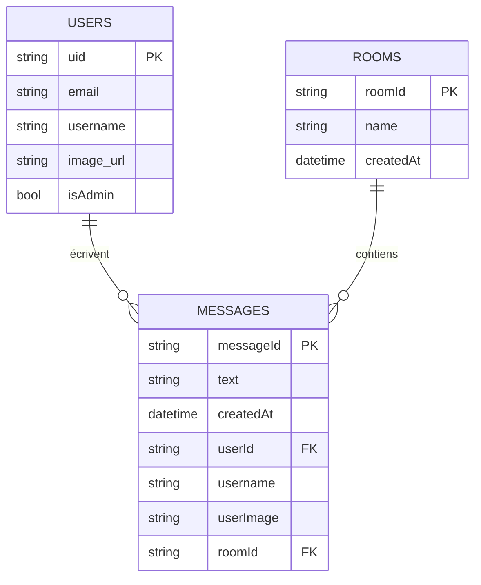

# 📱 Projet Été – Application de Messagerie Flutter

Dans le cadre de mon travail d’été, j’ai développé cette petite application de messagerie afin de mettre en pratique et démontrer mes compétences en **Flutter**. L’objectif est de permettre un échange simple et rapide de messages.

---

## 🚀 Fonctionnalités principales
- Envoi et réception de messages en temps réel  
- Interface fluide et responsive  
- Design simple et intuitif  
- Compatibilité Android (et iOS avec quelques ajustements)  
- Gestion des **rooms** (salons)  
- Rôle **admin** : créer/supprimer des rooms (supprime aussi les messages)  
- Notifications push (FCM) par room

---

## 🛠️ Technologies utilisées
- **Flutter** (framework)  
- **Dart** (langage)  
- **Firebase** (backend) :  
  - **Cloud Firestore** (base temps réel)  
  - **Firebase Authentication** (comptes utilisateurs)  
  - **Firebase Storage** (photos de profil, fichiers)  
  - **Firebase Cloud Messaging (FCM)** (notifications)  
  - **Firebase Functions** (détection de nouveaux messages → envoi de notifications)

---

## 📦 Installation et exécution
1. **Cloner le projet**
   ```bash
   git clone https://github.com/ossydreos/classroom.git
   ```
2. **Accéder au dossier**
   ```bash
   cd classroom
   ```
3. **Installer les dépendances**
   ```bash
   flutter pub get
   ```
4. **Lancer l’application**
   ```bash
   flutter run
   ```

## 📦 Installation aussi possible depuis -> Releases -> .apk


## 🗂️ Modèle de données (Firestore)




---


✍️ *Développé par Youri dans le cadre d’un projet d’été*
